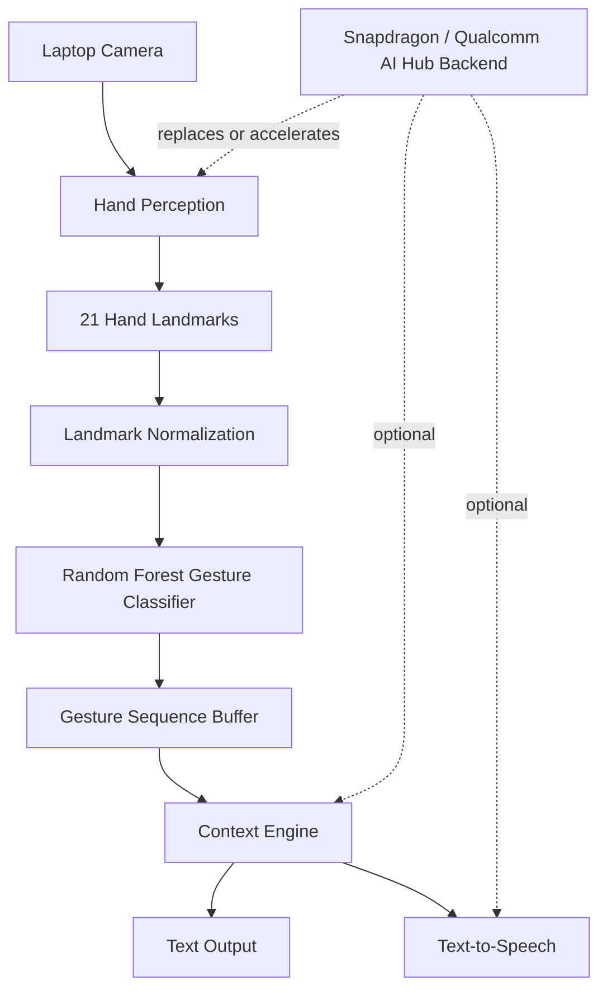

# Architecture

```mermaid
flowchart TD
    A[Laptop Camera] --> B[Hand Perception]
    B --> C[21 Hand Landmarks]
    C --> D[Landmark Normalization]
    D --> E[Random Forest Gesture Classifier]
    E --> F[Gesture Sequence Buffer]
    F --> G[Context Engine]
    G --> H[Text Output]
    G --> I[Text-to-Speech]
    J[Snapdragon / Qualcomm AI Hub Backend] -. replaces or accelerates .-> B
    J -. optional .-> G
    J -. optional .-> I
```

The dashed path represents the intended Snapdragon optimization path, not a claim that every baseline component is currently NPU-accelerated.
